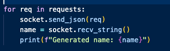
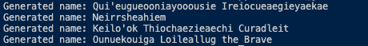
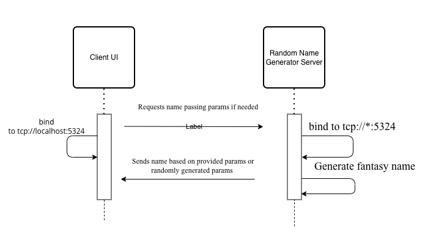

# Fantasy Name Generator
This microservice generates a fantasy name or multiple names for D&D campaigns

## Pre-requisites
Install ZeroMQ

## Installation
Clone this github repo and download the name_gen_server.py file to run locally

## Requesting Data
To request data from the microservice, make a call to "tcp://localhost:5324" and pass an empty dictionary({}) using the socket.send_json() method. 

The generated name will be of random name pattern and length, with a 30% chance to have a "special character" (For example instead of Kael, Ka-el or Ka'el) and a 30% chance to have a random title added (The Brave, Stormborn, etc.)

Optional dictionary parameters:
{
    "name_num": [int] allows a name length to be specified,
    "race": ["elf"/"dwarf"] for specific patterns pertaining to these races
    "add title": [True/False] for a random title to be added to the name
}

## Recieving Data
A name will be returned to the console or variable as a string. As such make use of  the socket.recv_string() method. The example below shows the generated names stored in a name variable, printed to the console using f"Generated name: {name}"

## UML Sequence Diagram

